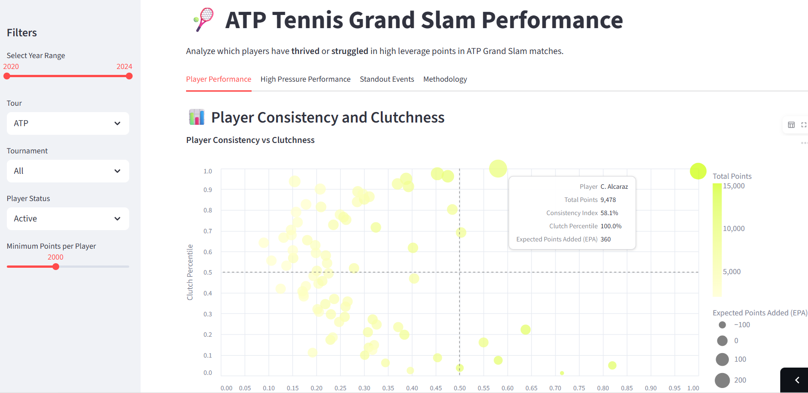
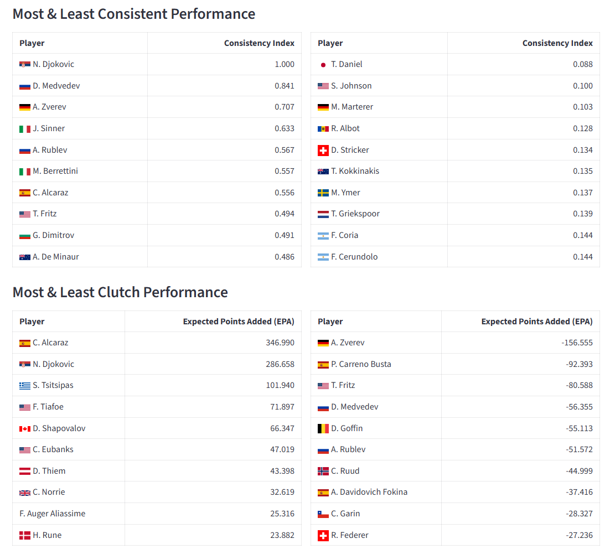

# Tennis Pressure Simulation Project 🎾

[Open Streamlit App](https://tennis-point-by-point-m8ybckcbdtzd7thhbpgtme.streamlit.app/)



## Methodology

### Overview
This project aims to quantify subjective measures of **consistency** and **clutchness** of tennis players, using a win-probability model and Monte Carlo simulations at each point of all matches.  
Each point is simulated **3,000 times** to estimate impact on match win probability.

---

### Point Simulations
For each recorded point, **3,000 full match simulations** are calculated to determine each player's probability of winning the match.  

The 3,000 simulations fall into 3 buckets (1,000 simulations each):

- **Probability before the point**  
- **Probability if player 1 wins the point**  
- **Probability if player 2 wins the point**  

The difference between the match probabilities in these scenarios is defined as the **point importance**.

---

### Key Metrics
- **Expected Points Added (Clutchness):**  
  Estimated ATP/WTA points gained or lost compared to the player's normal level.  
  Calculated as the product of each player’s win probability added/lost per point, the importance of those points, and the ATP/WTA points at stake in the given match.  

- **Consistency:**  
  A measure of how high a player’s win probability is throughout matches and how stable those probabilities remain.  
  Calculated as the normalized product of the mean win probability added times the inverse of the standard deviation of the win probability change per point.  

- **High Pressure Points:**  
  Defined as the **top quartile (25%)** of points by importance.  

---

### Assumptions
- Simulation count can be increased for higher accuracy, but **1,000 per scenario (3,000 per point)** was chosen to balance scale and accuracy.  
- Small-sample players may be noisy, so a minimum threshold is applied:  
  - **400 points per year** for ATP  
  - **200 points per year** for WTA  

---

---


## File Overview

The project consists of the following components:

1. **`prepare_data.py`**  
   Prepares and cleans the raw tennis match datasets, reconstructs game scores and match states, and outputs a merged CSV ready for simulation.

2. **`point_importance_simulation.py`**  
   Contains the core Monte Carlo simulation logic to simulate tennis points, games, tiebreaks, sets, and matches. Calculates the importance of each point by estimating how winning or losing it affects the player’s overall chance of winning the match.

3. **`main_full_run.py`**  
   Runs the importance simulation over the entire dataset in chunks (to handle large files efficiently), and saves the enriched results with importance scores into a DuckDB database and an output CSV.

4. **`transform.py`**  
   Loads the DuckDB, and performs database transformations to restructure data and create tables in DuckDB, performing aggregations and getting data ready for efficient querying.

4. **`data.py`**  
   Runs transformations and creates functions for loading data for each tab of the streamlit application.

4. **`data_processing.py`**  
   Contains all major Python aggregations and calculations on measuring clutchness, consistency, etc.

4. **`utils.py`**  
   Compiles helper functions in rendering html and images, applying filters, etc.

4. **`app.py`**  
   A Streamlit web app to interactively explore the simulation results. It lets users filter by year, tour (ATP/WTA), tournament, and minimum points played threshold to see which players thrive or struggle under pressure.

---

## How to Run Locally

### Requirements

- Python 3.8+
- Packages: `pandas`, `numpy`, `numba`, `duckdb`, `streamlit`, `altair`, `re`

Install dependencies via pip:

```bash
pip install pandas numpy numba duckdb streamlit altair
```

Step 1: Prepare Data
Run the data preparation script to create the merged dataset:

```bash
python prepare_data.py
```

Step 2: Run Point Importance Simulations
Run the full simulation to compute point importance scores and save results:

```bash
python main_full_run.py
```

The simulation count can be adjusted but 1000 was chosen, weighing accuracy and efficiency.

Step 3: Launch Interactive Explorer
Start the Streamlit app to explore results:

```bash
streamlit run app.py
```

Open the URL shown in your terminal (http://localhost:8501)

---

Notes

- Simulations are stochastic and results vary slightly per run.

- N_SIMULATIONS parameter in main_full_run.py controls simulation accuracy vs speed.

- Future iterations will aim to incorporate lower-level matches outside of Grand Slams for larger sample size

