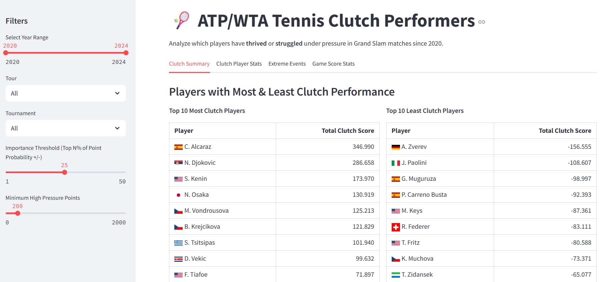

# Tennis Pressure Simulation Project 🎾

## Methodology

### Overview
This project aims to quantify subjective measures of **consistency** and **clutchness** of tennis players, using a win-probability model and Monte Carlo simulations at each point of all matches.  
Each point is simulated **3,000 times** to estimate impact on match win probability.

---

### Point Simulations
For each recorded point, **3,000 full match simulations** are calculated to determine each player's probability of winning the match.  

The 3,000 simulations fall into 3 buckets (1,000 simulations each):

- **Probability before the point**  
- **Probability if player 1 wins the point**  
- **Probability if player 2 wins the point**  

The difference between the match probabilities in these scenarios is defined as the **point importance**.

---

### Key Metrics
- **Expected Points Added (Clutchness):**  
  Estimated ATP/WTA points gained or lost compared to the player's normal level.  
  Calculated as the product of each player’s win probability added/lost per point, the importance of those points, and the ATP/WTA points at stake in the given match.  

- **Consistency:**  
  A measure of how high a player’s win probability is throughout matches and how stable those probabilities remain.  
  Calculated as the normalized product of the mean win probability added times the inverse of the standard deviation of the win probability change per point.  

- **High Pressure Points:**  
  Defined as the **top quartile (25%)** of points by importance.  

---

### Assumptions
- Simulation count can be increased for higher accuracy, but **1,000 per scenario (3,000 per point)** was chosen to balance scale and accuracy.  
- Small-sample players may be noisy, so a minimum threshold is applied:  
  - **400 points per year** for ATP  
  - **200 points per year** for WTA  

---

---

## Tennis Pressure-Point Dashboard


[Open Streamlit App](https://tennis-point-by-point-52524ann5ef7v8ixz69lt9.streamlit.app/)

## Overview

The project consists of four main components:

1. **`prepare_data.py`**  
   Prepares and cleans the raw tennis match datasets, reconstructs game scores and match states, and outputs a merged CSV ready for simulation.

2. **`point_importance_simulation.py`**  
   Contains the core Monte Carlo simulation logic to simulate tennis points, games, tiebreaks, sets, and matches. Calculates the importance of each point by estimating how winning or losing it affects the player’s overall chance of winning the match.

3. **`main_full_run.py`**  
   Runs the importance simulation over the entire dataset in chunks (to handle large files efficiently), and saves the enriched results with importance scores into a DuckDB database and an output CSV.

4. **`streamlit_app.py`**  
   A Streamlit web app to interactively explore the simulation results. It lets users filter by tournament, gender, perspective (serve/return), and see which players thrive or struggle under pressure with tables and visualizations.

---

## File Details

### 1. `prepare_data.py`

- Parses raw tennis data files.
- Reconstructs match scoring sequences (points, games, sets).
- Adds calculated columns needed for simulations.
- Outputs a merged, cleaned CSV (`merged_tennis_data.csv`) to be used by simulations.

### 2. `point_importance_simulation.py`

- Uses `numba` for fast Monte Carlo simulation of tennis matches at the point level.
- Simulates games, tiebreaks, sets, and full matches based on player serve/return win probabilities.
- Calculates **point importance**: difference in probability of winning the match if player wins vs loses that point.
- Provides functions to apply simulations row-wise on match point dataframes.

### 3. `main_full_run.py`

- Loads the prepared CSV in chunks to avoid memory overload.
- Filters and cleans data (e.g., ensures valid point numbers).
- Runs importance simulations on each chunk with configurable simulation counts.
- Stores results incrementally in a DuckDB database for fast querying.
- Exports a full CSV file (`all_points_with_importance.csv`) with the importance scores added.

### 4. `streamlit_app.py`

- Loads results from DuckDB or CSV.
- Provides user controls for filtering by tournament, gender, and perspective (serve/return/all).
- Calculates clutch statistics per player — how their performance changes under pressure.
- Displays top/worst performers and heatmaps of win rates by game score.
- Interactive UI powered by Streamlit and Altair.

---

## How to Run

### Requirements

- Python 3.8+
- Packages: `pandas`, `numpy`, `numba`, `duckdb`, `streamlit`, `altair`, `re` (standard)

Install dependencies via pip:

```bash
pip install pandas numpy numba duckdb streamlit altair
```

Step 1: Prepare Data
Run the data preparation script to create the merged dataset:

```bash
python prepare_data.py
```

Step 2: Run Point Importance Simulations
Run the full simulation to compute point importance scores and save results:

```bash
python main_full_run.py
```

The simulation count can be adjusted but 1000 was chosen, weighing accuracy and efficiency.

Step 3: Launch Interactive Explorer
Start the Streamlit app to explore results:

```bash
streamlit run streamlit_app.py
```

Open the URL shown in your terminal (http://localhost:8501)

---

## Screenshots

### Summarizing the Most and Least Clutch Players


---

### Players Most and Least Often Under Pressure


---

### Players with Most Unlikely Outcomes


---


Notes

- Simulations are stochastic and results vary slightly per run.

- N_SIMULATIONS parameter in main_full_run.py controls simulation accuracy vs speed.

- DuckDB enables efficient querying on large result datasets.

- The app’s “Clutch Delta” measures how much better or worse a player performs on high-pressure points compared to average.


